# java-exam
Java实现的包含题库编辑、抽题组卷、试题分析、在线考试等模块的Web考试系统。

已经实现的主要功能有：
- 在线考试（包含限定时间设置），支持选择题、填空题、判断题三种题型，自动判分
- 选择题、填空题、判断题及用户信息的文本文件数据的Web导入
- 用户注册、登录、修改密码、基本信息管理
- 按照一定给分策略进行抽题和组卷，支持“固定组卷” 和“随机组卷”两种方式
- 按照内容、知识点、答案等搜索题库，题目及分数的统计
- 章节知识点的分层和树状展示
- 管理广播消息的推送、系统设置的修改

目前项目基于以下平台（框架、库）:
- JDK 1.8
- Tomcat 8.0 (with WebSocket)
- Hibernate 5.1 
- Struts 2.5
- Spring 4.3
- JFreeChart 1.0.19
- Maven
- Materialize v0.97.6 (CSS)
- Font Awesome 5.1.1

项目在Eclipse JEE下开发。

数据库设计：
- (MySQL Workbench导出)
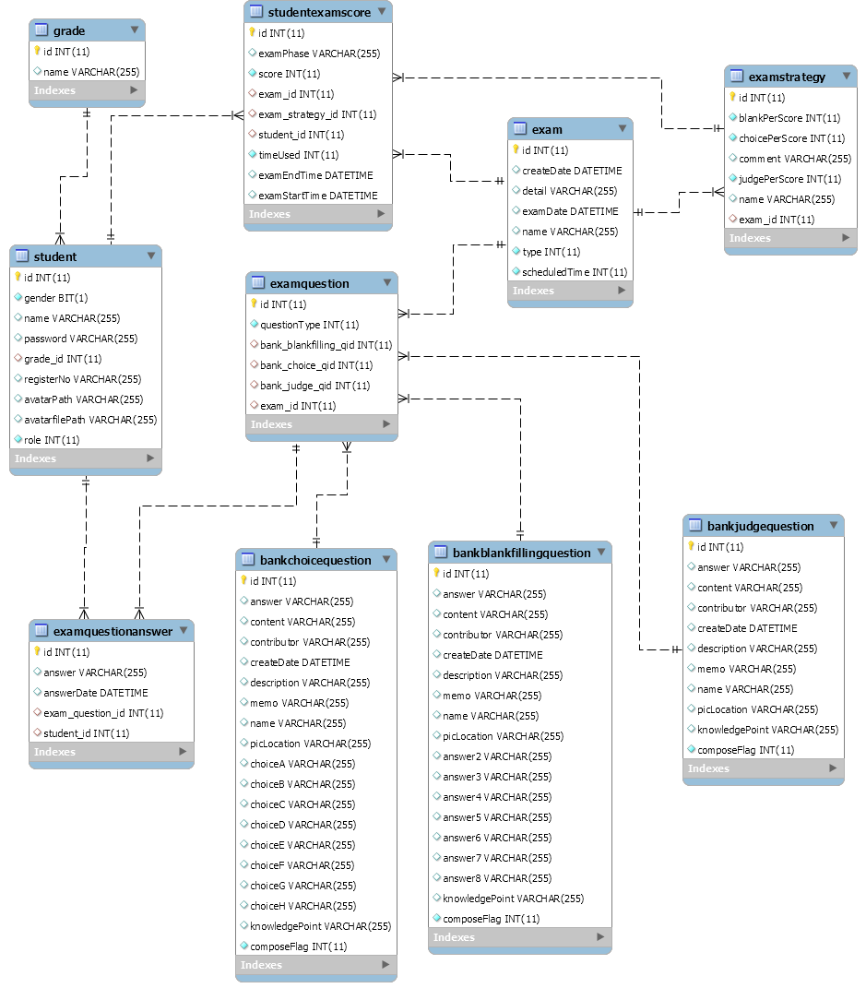

- (简版)
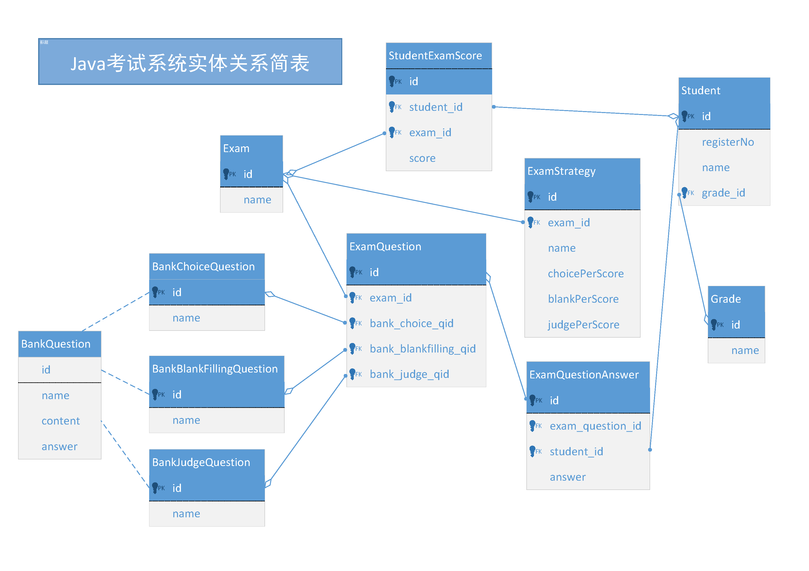

部分功能截图如下：
- (未登录)
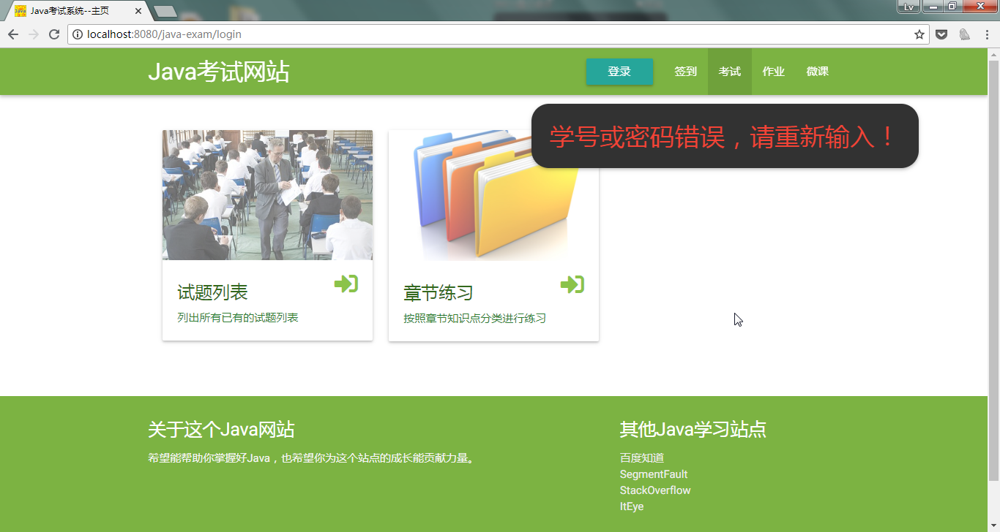

- (教师用户登陆)
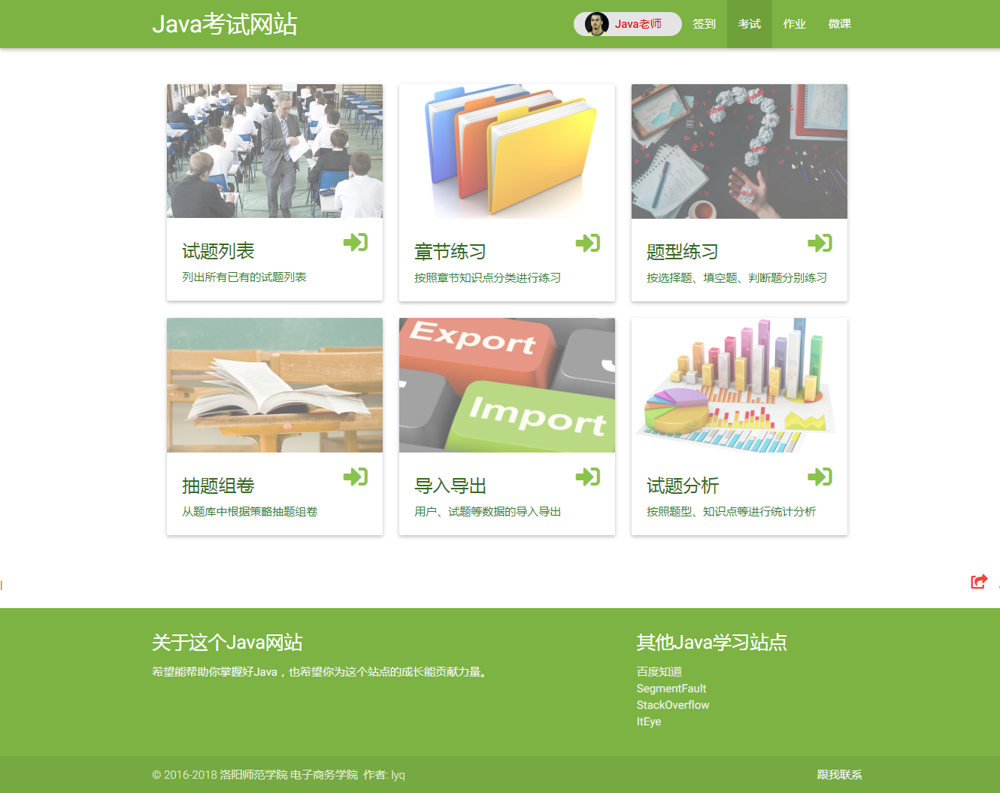

- (知识点展示)
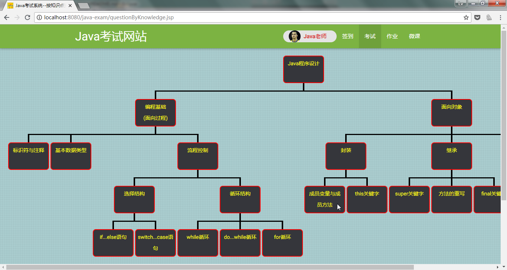

- (答题扇形图)
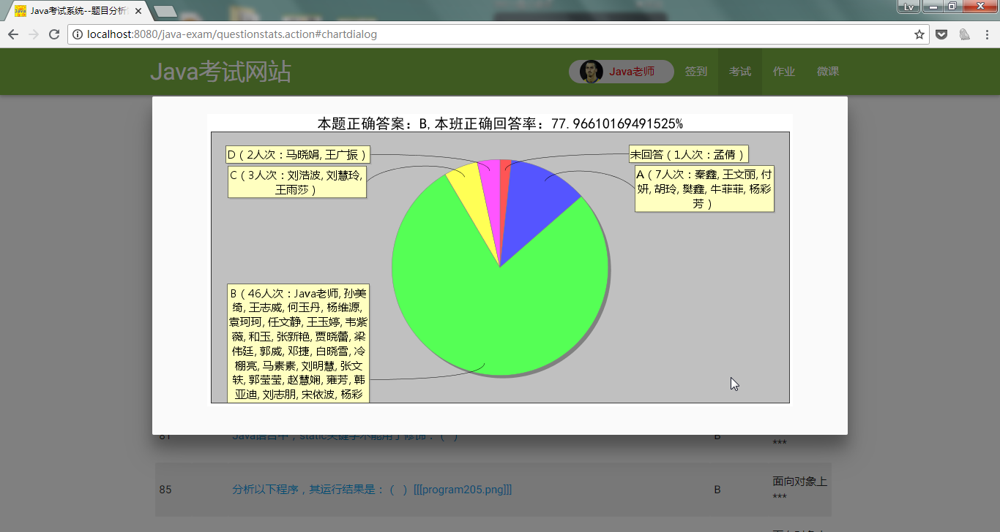

- (成绩柱状图)
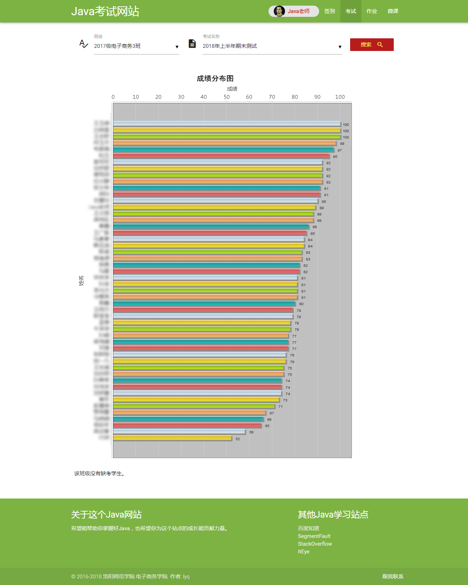

- (固定组卷)
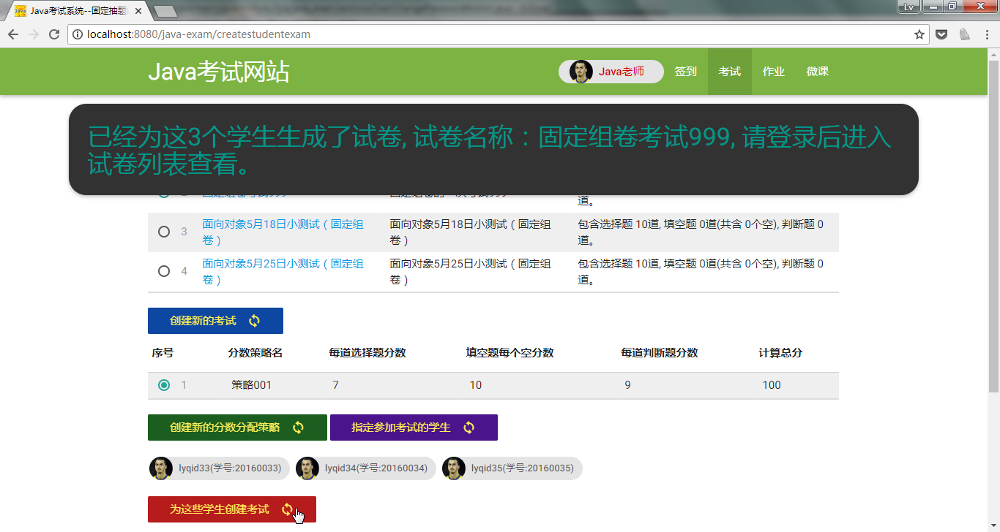

- (随机组卷)
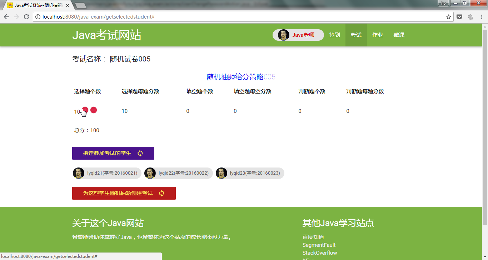

- (导入题库及学生信息)
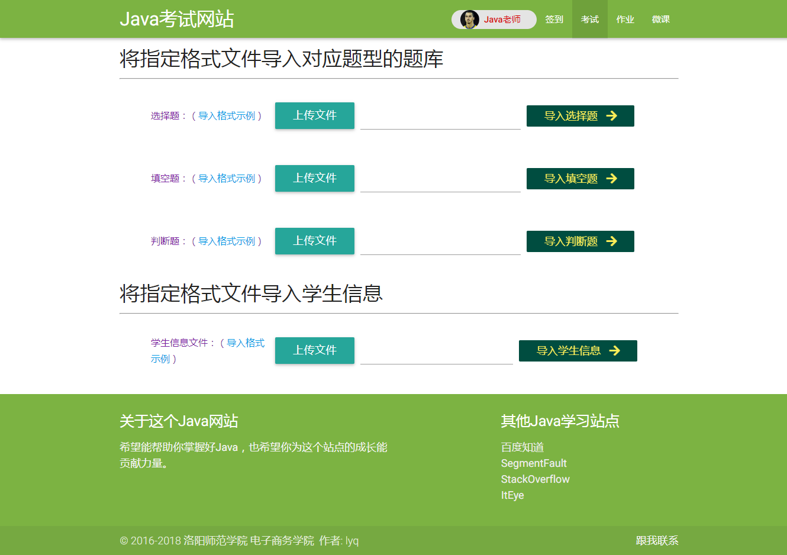

- (未考和已考列表)
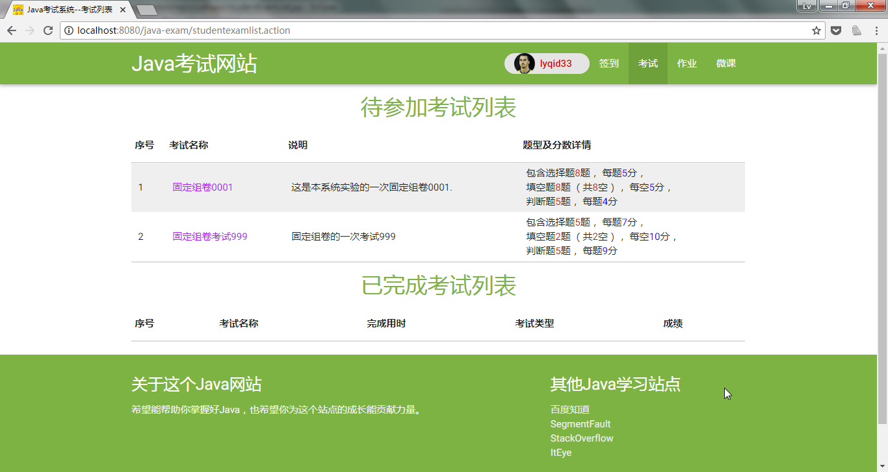

- (在线考试中)

